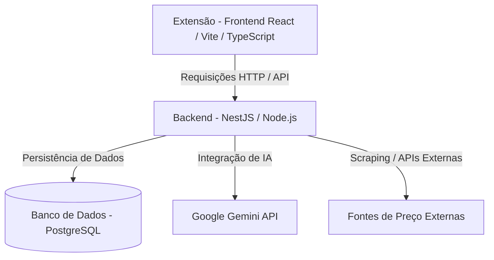

# 🛒 Shop Safe AI

## 📌 Sobre o Projeto

O **Shop Safe AI** é uma extensão de navegador inteligente desenvolvida como Trabalho de Conclusão de Curso (TCC) para o curso de Engenharia de Software no Centro Universitário Católica de Santa Catarina. O objetivo principal é auxiliar usuários durante suas compras online, facilitando a tomada de decisão por meio de análises em tempo real de preços, confiabilidade de lojas e sugestões inteligentes baseadas em Inteligência Artificial.

---

## 📺 Apresentação em Vídeo e Demonstração

Assista à apresentação completa do projeto e demonstração da ferramenta no YouTube:

---

## 🛝 Slides da Apresentação

Os slides utilizados na defesa do TCC estão organizados no diretório `/slides` deste repositório.

* 📄 [Acesse a pasta de slides aqui](./slides/)

---

## 🚨 O Problema

Consumidores enfrentam diversos desafios e riscos ao realizar compras no comércio eletrônico (e-commerce), tais como:

1. **Dificuldade em comparar preços:** Necessidade de navegar por múltiplos sites e abas para encontrar a melhor oferta.
2. **Falta de transparência na confiabilidade:** Dificuldade em identificar rapidamente se uma loja ou vendedor é seguro e legítimo.
3. **Fadiga de decisão:** Excesso de abas abertas e informações dispersas que atrasam a compra.
4. **Segurança digital:** Risco crescente de golpes, fraudes e páginas de e-commerce falsas.

---

## 💡 A Solução Proposta

O **Shop Safe AI** resolve esses problemas integrando-se diretamente à experiência de navegação do usuário. Ao acessar a página de um produto, a extensão automaticamente captura e analisa as informações relevantes para exibir:

* **💰 Comparação de Preços:** Alternativas de ofertas em tempo real em outras plataformas confiáveis.
* **🏪 Lojas Alternativas:** Sugestões qualificadas de e-commerce que oferecem o mesmo item.
* **🔒 Análise de Confiabilidade:** Indicadores visuais sobre a reputação da loja e nível de segurança.
* **🤖 Recomendações com IA:** Insights inteligentes gerados pelo modelo Google Gemini sobre o produto e oportunidade de compra.

Tudo isso concentrado em uma interface intuitiva, sem a necessidade de sair da página atual.

---

## ⚙️ Arquitetura do Sistema

O sistema foi estruturado em três camadas principais para garantir escalabilidade, segurança e bom desempenho:

### Detalhamento das Camadas
1. **Frontend (Extensão):** Desenvolvido em **React** com **Vite** e **TypeScript**, interagindo com a Chrome Extension API para manipulação da aba ativa e exibição da interface gráfica integrada (sidebar ou popup).
2. **Backend (API):** Desenvolvido em **NestJS** e **Node.js**, atuando como orquestrador, responsável por consumir APIs externas, persistir dados e conectar com o ecossistema da Google AI.
3. **Banco de Dados:** Utilização de **PostgreSQL** para o armazenamento de histórico de consultas, dados estruturados de produtos e logs de análise de confiabilidade.
4. **Inteligência Artificial:** Integração via **API do Google Gemini** para processamento de linguagem natural (NLP), classificação de reviews e geração de recomendações de compra personalizadas.

---

## 🧠 Tecnologias Utilizadas

### Frontend (Extensão)
* **React** - Biblioteca para construção da interface.
* **TypeScript** - Tipagem estática para maior segurança e produtividade.
* **Vite** - Build tool rápido para desenvolvimento moderno.
* **TailwindCSS** (ou similar) - Framework utilitário de estilização.
* **Chrome Extension API** - Integração nativa com o navegador.

### Backend
* **NestJS** - Framework progressivo Node.js estruturado em arquitetura modular.
* **Node.js** - Ambiente de execução Javascript no servidor.
* **TypeScript** - Linguagem principal do backend.

### Banco de Dados
* **PostgreSQL** - Banco de dados relacional de alta confiabilidade.

### Inteligência Artificial
* **Google Gemini API** - Processamento inteligente das avaliações e análise contextual do produto.

---

## 📊 Funcionalidades Implementadas

* [ ] **Captura de Contexto:** Identificação automática de produtos visualizados na tela através do DOM.
* [ ] **Extração Inteligente:** Parsing de dados fundamentais (nome do produto, preço atual, loja).
* [ ] **Comparação Automatizada:** Busca e comparação de preços em diferentes marketplaces parceiros.
* [ ] **Reputação da Loja:** Cálculo e exibição de score de segurança/confiabilidade da loja em exibição.
* [ ] **Insights com IA:** Geração de sugestões e recomendações contextuais através da API Gemini.
* [ ] **Interface Integrada:** Design responsivo e limpo acoplado à página de e-commerce.

---

## 🚀 Possíveis Evoluções (Roadmap)

* [ ] **Aplicativo Mobile:** Versão móvel com leitura de código de barras ou imagem via câmera.
* [ ] **Alertas Ativos:** Notificações em tempo real sobre quedas de preço e cupons de desconto.
* [ ] **Histórico Dinâmico:** Gráfico interativo com a oscilação de preço do produto ao longo do tempo.
* [ ] **Análise de Reviews:** Inteligência artificial processando comentários de compradores para resumir pontos positivos e negativos.
* [ ] **Detector de Golpes Avançado:** Filtro anti-phishing usando IA para detectar sites clonados e fraudes financeiras.

---

## 📚 Referências e Trabalhos Relacionados

O desenvolvimento deste TCC buscou referências em soluções consolidadas de mercado e literatura acadêmica sobre comércio eletrônico:
* **Extensões de comparação e cupons:** Análise do funcionamento de ferramentas populares como *Buscapé*, *Méliuz* e *PriceBlink*.
* **Histórico de preços:** Estudo sobre o comportamento de trackers como *Keepa* (para a Amazon).
* **Análise de sentimento com Processamento de Linguagem Natural:** Trabalhos acadêmicos voltados à extração de reviews de e-commerce para classificação de opinião de consumidores.

---

## 👨‍💻 Autor

**Luiz Eduardo Uber**
* 🎓 Curso: Engenharia de Software
* 🏫 Instituição: Centro Universitário Católica de Santa Catarina
* 📧 Contato: [Adicione seu e-mail ou perfil do LinkedIn aqui]
